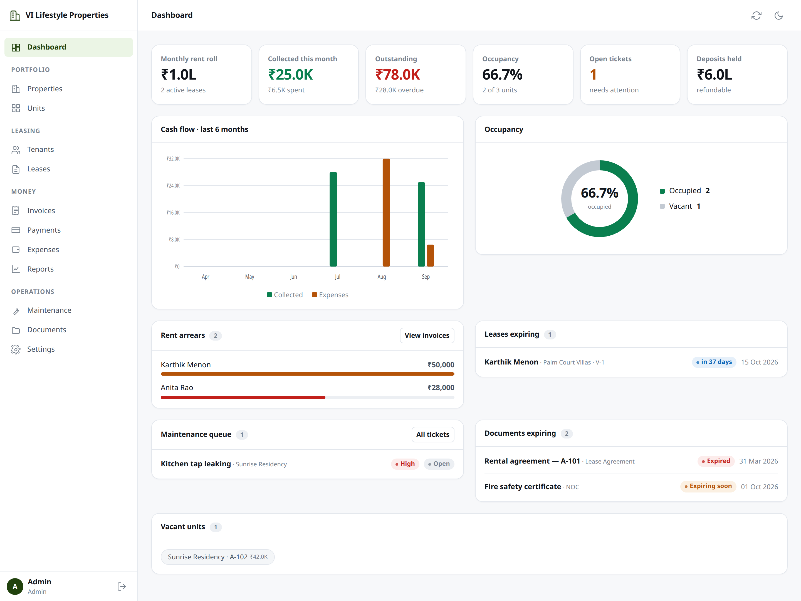

# Property & Tenancy Manager

A complete property management application: properties, units, tenants, leases,
rent invoicing, payments, maintenance, expenses, documents and reports. The app is
hosted **free on GitHub Pages**, with a **Supabase (Postgres)** database behind it.

No build step and no framework — plain ES modules — and it installs on a phone
like an app.



---

## How it works

```
GitHub Pages                 Supabase Edge Function         Supabase Postgres
┌───────────────────┐        ┌────────────────────┐        ┌──────────────────┐
│  static app       │──────► │  API "api"         │──────► │  tables, foreign │
│  vanilla ES       │ HTTPS  │  sign-in, roles,   │  SQL   │  keys, checks    │
│  modules, no deps │◄────── │  billing rules     │◄────── │                  │
└───────────────────┘        └────────────────────┘        └──────────────────┘
```

Every rule lives in the API and every request runs in one transaction, so nothing
is ever left half-saved and two people can never overwrite each other's work.

## What it does

- **Record pages for everything** — a tenant, unit, lease, invoice or payment
  opens on its own page with everything related to it, linked onward. Hover a
  linked name for a summary card; IDs, phones and emails copy in one click.
- **Search everything** — one box in the top bar (or `/`, or Ctrl/⌘ K) finds
  tenants, properties, units, leases, invoices, payments, tickets, expenses and
  documents by name, phone, unit, ID, reference or description.
- **One Billing screen** — invoices and the payments against them, with
  outstanding / overdue / due-this-week / collected figures that double as filters.
- **Rent days** — a monthly lease can be due on a fixed day (say the 10th), and
  grace days count after it before the late fee. Rent invoices are raised by hand
  each month.
- **Invoices with any mix of charges** — rent, electricity (EB), water and more as
  separate lines, each with its own GST rate.
- **Accounting that holds up** — deposits are held money, not income; issued
  invoices are voided, never deleted, and their numbers never reused; GST with
  CGST/SGST/IGST and printed tax invoices.
- **Move-out and renewal** — settle a deposit against arrears and deductions in
  one step; renew a lease with the escalated rent and the deposit carried over.
- **Tenant-friendly** — statements, receipts, WhatsApp sharing and UPI payment links.
- **Reports** — per-property P&L with gross yield, arrears ageing, collection
  rate, CSV export.
- **Roles enforced on the server** — viewer / manager / admin, with sign-in
  throttling, no account enumeration, and a setup path that cannot be hijacked.

Full list: **[docs/FEATURES.md](docs/FEATURES.md)**.

## Setup

**→ [docs/SETUP.md](docs/SETUP.md)** — create the Supabase project, deploy the API,
publish the site, and what to do day to day.

Once set up, a push to `main` tests everything, runs any new database migrations,
deploys the API, and publishes the site — in that order.

## Repository layout

```
index.html               entry point — loads assets/js/app.js as a module
manifest.webmanifest     installable-app metadata (name, icons, colours)
sw.js                    service worker — offline shell, cache per build
assets/
  css/styles.css         design system — spacing and type scales, brand accent,
                         light + dark themes
  icons/                 app icons, including a maskable one for Android
  js/
    app.js               shell, routing, boot sequence
    schema.js            ⭐ every entity definition — drives forms, tables, filters
    store.js             the small tables (properties, units, tenants, leases) kept in
                         the browser; pages and summaries of the rest from the API
    api.js               the API transport (text/plain POST, no CORS preflight)
    components/          form builder · data table · charts · record pages · hover cards · search
    views/               one module per screen
supabase/
  migrations/            the database, one migration at a time
  functions/api/         the API: every action and business rule
scripts/                 deploy helpers, and admin recovery
test/                    backend, security and browser tests
docs/                    setup, features, data model
```

**To restyle**, change the `--brand` tokens at the top of
[`assets/css/styles.css`](assets/css/styles.css). A test asserts the result still
clears WCAG AA contrast in both themes.

**To add a field**, see [docs/DATA_MODEL.md](docs/DATA_MODEL.md#adding-a-field):
a migration, one line in the API's schema, one in the app's.

## Development

```bash
npm install          # postgres + puppeteer-core, for the tests
npm run db:test      # a disposable Postgres in Docker on port 55432
npm run dev          # the app + the real API on that database, with sample data
npm test             # every suite
```

`npm run dev` runs the **real** API against a throwaway database filled with a
sample portfolio dated around today, so every business rule applies exactly as it
does live. Sign in with phone `9000012345` / password `password123`.

| Suite | What it proves |
|---|---|
| `test:backend` | Rent days and late-fee grace |
| `test:paging` | Server-side paging, search and scopes, and every server-computed figure checked against the old in-browser arithmetic |
| `test:security` | Setup takeover, brute force, enumeration, forged tokens, role escalation |
| `test:production` | ~140 behaviour probes: billing, deposits, roles, concurrency, rollback |
| `test:http` | The HTTP surface, and that Supabase's public REST roles can reach no table |
| `test:ui` | The real app in headless Chrome, end to end |
| `test:responsive` | Every screen at 320–768px: no sideways page scrolling, thumb-sized targets |
| `test:pwa`, `test:pwa:ui` | It installs, opens offline, takes updates, never caches API data |

## Locked out?

`DATABASE_URL=… node scripts/recover-admin.mjs <phone>` makes that phone number an
active administrator with a new password and clears any lockout. It needs the
database connection string, which is exactly why the public API cannot do it. See
[docs/SETUP.md](docs/SETUP.md#locked-out).

## Limitations

The whole portfolio loads into the browser in one request: fast into the low
thousands of records, slower beyond. There is no tenant portal, no payment gateway
and no file upload (documents are links). Email reminders are built but not
connected to an email provider yet. Screens do not update live when someone else
saves — the second of two conflicting saves is refused instead.

## Licence

MIT — use it however you like.
